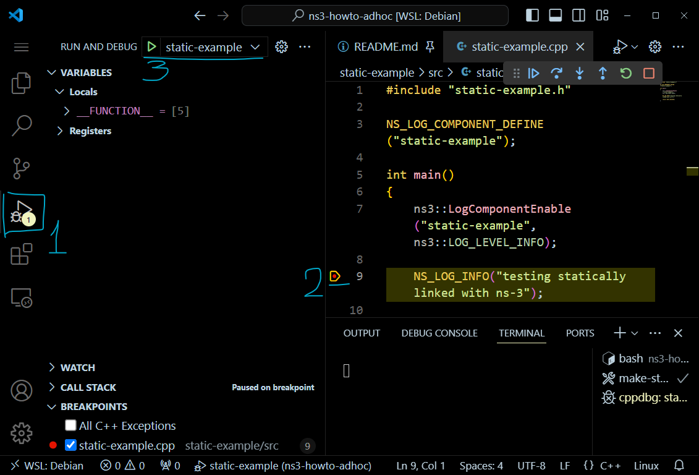
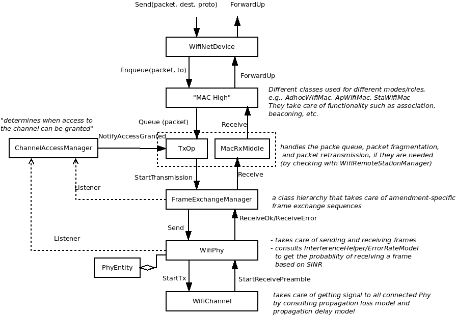
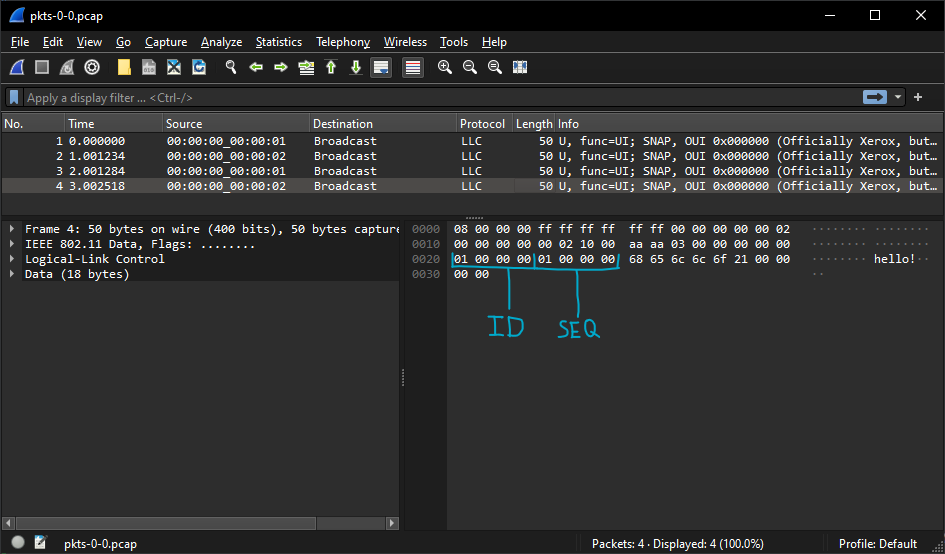
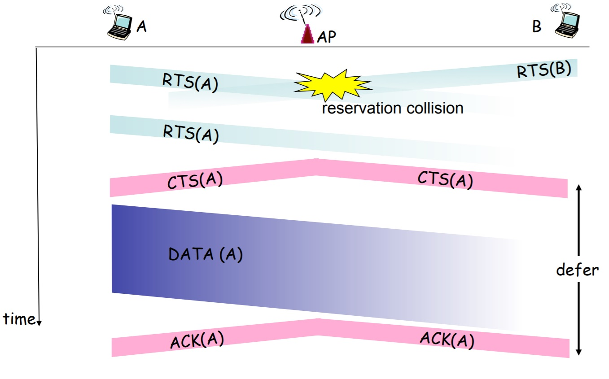
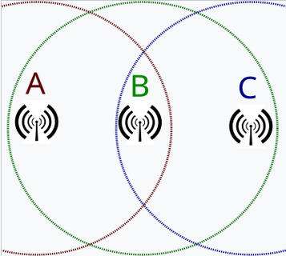

# Что это за проект

Основная идея проекта - рассмотреть механизмы `ns3` и их настройку для реализации `adhoc` сетей. На данный момент проект заморожен. Есть один рабочий пример, в котором реализована обработка события коллизии пакетов. И два примера для демонстрации этой проблемы.

# Немного про `ns3`

По большому счёту, `ns3` это набор `C++` классов (*модулей*), которые реализуют что-то похожее на настоящее сетевое взаимодействие и инструменты для удобного использования этих классов. 

> Суть в том, что всё это добро компилируется и нужно быть осторожным с компилятором `C++`: смотреть на реализацию того, с чем вы работаете (*особенно с контейнерами от `ns3`*). Если компилятор не ругается, это не значит, что он соберёт всё так, как вы задумывали.

# Где это делать?

Рекомендую `WSL Debian` и `VSCode`

# С чего начать - туториал от `ns3`

В первую очередь следует вдумчиво пройти туториал от `ns3`:
[3.42-tutorial](https://www.nsnam.org/docs/release/3.42/tutorial/html/quick-start.html)

> Рекомендую скачивать `ns3` через архив исходников: `.tar.bz2`

После этого вы узнаете минимальный набор механик, в том числе:
- как собираться c `CMake` в директории `ns3`
- как пользоваться системой логов
- основные компоненты: `ns3::Node`, `ns3::NetDevice`, `ns3::Application`


# Как компилироваться и отлаживаться

Мне не нравится компилироваться в папке `scratch/` с помощью `CMake` поэтому существует эта секция, в которой рассказывается, как использовать `ns3` в качестве статической либы

> Все примеры в этом проекте собираются со статической либой `ns3`

## 1. Подготовить сборку
<!-- 
> Если хочется собраться с нормальной визуализацией то [см. пункт "Сборка с PyViz"](#сборка-с-pyviz) -->

```sh
./ns3 configure --cxx-standard 20 -d debug --enable-static\
    --enable-asserts --enable-logs\
    --disable-examples --disable-tests --disable-gtk\
    --disable-python-bindings\
    --output-directory static-build\
    --disable-modules "bridge;csma;buildings;uan;point-to-point;fd-net-device;lr-wpan;virtual-net-device;traffic-control;topology-read;config-store"
```

Параметры:
```
    --enable-asserts      Enable the asserts regardless of the compile mode
    --disable-examples    Disable the ns-3 examples
    --disable-gtk         Disable GTK support in ConfigStore
    --enable-logs         Enable the logs regardless of the compile mode
    --disable-python-bindings   Disable python bindings
    --disable-tests       Disable the ns-3 tests
    --enable-static       Build a single static library with all ns-3
    --output-directory    Directory to store build artifacts
```

Минимальный список модулей, которые должны собраться для этого проекта:
```
Modules configured to be built:
antenna                   core                      energy
mobility                  network                   propagation
spectrum                  stats                     wifi
```


## 2. Собрать `ns3`

```sh
./ns3 build
```
Вы получите две важные директории:
```
ns-3.42/static-build/
    include  - заголовки ns3
    lib      - .so-шки и статическая либа ns3
```

## 3. Собрать документацию `Doxygen`

> Если не собрали в ходе туториала

С помощью команды собрать документацию:
```sh
./ns3 docs doxygen-no-build
```

В результате получите `html` документацию: 
`ns-3.42/doc/html/index.html`

> Порой это единственный верный способ понять, что происходит под капотом `ns3`

> Если работаете в `WSL`, директорию `html` можно открыть прямо на хосте. У меня, с образом `Debian` путь до `index.html`: `file://///wsl.localhost/Debian/home/user/workspace/ns-allinone-3.42/ns-3.42/doc/html/index.html`

> Документацию можно и просто выгрузить на хост

Также рекомендую заменить файл `ns-3.42/doc/html/doxygen.css` на файл из проекта `files/doxygen-style/doxygen.css`. Он немного фиксит неочевидные цветовые решения в документации

## 4. Попробовать собраться со статической либой `ns3`
В директории `static-example` лежит минимальный проект, собираемый с помощью `make`

Перед сборкой нужно обновить файл `.env` и указать корректный путь до директории `static-build` с собранным на прошлом шаге `ns3`: `PATH_NS3_STATIC_BUILD_DIR`

Сборка:
```sh
user@w:~/workspace/ns3-projects/ns3-howto-adhoc/static-example
 ~~~> make
Creating directories
make[1]: Entering directory '/home/user/workspace/ns3-projects/ns3-howto-adhoc/static-example'
Compiling: src/static-example.cpp -> build/static-example.o
g++  -Wextra -g -static  -I include/ -I /usr/local/include -I /home/user/workspace/ns-allinone-3.42/ns-3.42/static-build/include -MP -MMD -c src/static-example.cpp -o build/static-example.o
Linking: build/bin/static-example
g++ build/static-example.o -o build/bin/static-example -L/home/user/workspace/ns-allinone-3.42/ns-3.42/static-build/lib -l:libns3.42-static-default.a
Making symlink: static-example -> build/bin/static-example
make[1]: Leaving directory '/home/user/workspace/ns3-projects/ns3-howto-adhoc/static-example'
```
Запуск:
```sh
user@w:~/workspace/ns3-projects/ns3-howto-adhoc/static-example
 ~~~> ./experiment
testing statically linked with ns-3
```

## 5. Как отлаживаться в `VSCode`

В файле `.vscode/launch.json` лежат конфигурации запуска и отладки экспериментов из этого проекта. Одним из ключевых параметров является `preLaunchTask`, который ссылается на задачи (*сборку*) в `.vscode/tasks.json`, выполняемые перед запуском

> В файле `.vscode/c_cpp_properties.json` не забудьте указать путь до `ns-3.42/static-build/include/` в `includePath`, чтобы `VSCode` подсасывал нужные заголовочные файлы и не ругался попусту

Так, например для запуска `static-example` нужно перейти на вкладку `Run and debug`, выбрать соответствующую конфигурацию запуска и запустить:



# Первый эксперимент и основе положения данного проекта

## Небольшое запугивание

Надеюсь, вы внимательно прошли туториал и имеете представление об основных компонентах симуляции `ns3`. На всякий случай напомню ключевой момент, который нужно держать в голове:

> `ns3` - библиотека, в которой реализованы модели сетевого взаимодействия и инструменты для построения симуляции. Важно, что симуляция основана на очереди событий и не является "real-type" симулятором. По факту любое сетевое взаимодействие - перекладывание буферов из этого объекта в другой. То, насколько такое перекладывание соответствует реальному положению вещей зависит от глубины проработки используемой модели. Далее для симуляции `adhoc` сетей используется модель `wifi`: [Документация](https://www.nsnam.org/docs/release/3.42/models/html/wifi.html). Данная модель проработана довольно глубоко и является очень (~~*даже слишком*~~) модульной, что продиктовано стандартом `wifi`: `ieee 802.11`.
 
Для `ieee 802.11` определены несколько стандартов, где каждый последующий - некоторое улучшение или развитие предыдущего. При реализации `adhoc` сети нужно выбрать параметры, которые влияют на то, как узлы будут "передавать" информацию. Это важно потому, что стандарт `ieee 802.11` не предусматривает дуплексный режим передачи и его частичная реализация в `ns3` тоже 🙃. Это значит, что сетевой интерфейс узла [не может одновременно передавать и получать информацию](https://en.wikipedia.org/wiki/Duplex_(telecommunications)#Half_duplex):


А когда узлы пытаются вещать в одно и то же время, что для `ns3` частая ситуация *(так как симуляция основана на очереди событий, привязанных к точному времени)*, начинается сущий кошмар, если не понимать, что происходит. **Об этом далее**.

## Про `IP Stack` и `Helper`-ов

Один из важных вопросов, на который вы должны ответить в начале создания симуляции: нужен ли мне `IP` стек *(и выше по OSI)* или хватит отправки фреймов? Для экспериментов в этом проекте ответ: `IP` не нужен, потому не используется

> Если вы решили использовать `IP`, то скорее всего из примеров `ns3` вам присмотрелось использование `InternetStackHelper`. Для исключения ненужных непонятностей, которые возникнут в ходе разработки симуляции, рекомендую ознакамливаться с тем, что делает очередной `Helper`. Так, например, `InternetStackHelper` подключает несколько механизмов, которые, вероятно помешают вашему `adhoc-у`:
> - реализация `ARP`
> - поддержка `ICMP`
> - `TrafficControlLayer`
> - механизмы маршрутизации `IP`

## Первый эксперимент: `basic-broadcast`

В этом эксперименте реализована минимальная настройка симуляции:
1. Созданы узлы
```cpp
// basic-broadcast/src/experiment.cpp   
int main()
{
    // Create nodes:
    ns3::NodeContainer c;
    c.Create(numNodes);
```
2. На узлы установлено по одному `Wifi` интерфейсу: `WifiNetDevice`
```cpp
    // Install WifiNetDevice to nodes and configure Pcap log:
    ns3::NetDeviceContainer c_devs = InstallSimpleWifiDevice(c, true);
```
3. В этом же вызове для интерфейсов настроено журналирование полученных пакетов в директорию `pcaps`
4. Установлено расположение узлов в пространстве
```cpp
    // Set nodes position around circle
    DistributeAroundCircle(c, radius, velocity);
```
5. На узлы установлено приложение `BasicApp` из `basic-broadcast-app.h`
```cpp
    // Install BasicApp to nodes
    BasicAppInstaller basicAppHelper = BasicAppInstaller();
    ns3::ApplicationContainer apps = basicAppHelper.Install(c);
```
6. В приложении `BasicApp` узла `#0` запланирована отправка тестового сообщения:
```cpp
    // Get BasicApp installed to Node#0
    ns3::Ptr<BasicApp> node_0_app = ns3::DynamicCast<BasicApp>(apps.Get(0));
    // Schedule broadcast with App at Node#0
    node_0_app->ScheduleTestBroadcast();
    /* ... */
} // < main
```
> Если вы ещё плаваете в `ns3`, то рекомендую посмотреть все исходники, которые лежат в проекте по описанным выше шагам

### Базовая настройка `wifi`
Базовая настройка `wifi` реализована в функции:
```cpp
// basic-broadcast/src/wifi-helper.cpp
ns3::NetDeviceContainer
InstallSimpleWifiDevice(ns3::NodeContainer nodes, bool enable_pcap=true)
```

Чтобы понимать ключевые компоненты модели `wifi` в `ns3` нужно ознакомиться с её [Архитектурой](https://www.nsnam.org/docs/release/3.42/models/html/wifi-design.html#wifi-architecture):




Ключевые элементы модели "сверху-вниз":
1. `MAC high` - высокоуровневые операции, время выполнения которых не важно
> Это, например, отправка [`Beacon frame`](https://en.wikipedia.org/wiki/Beacon_frame), когда `wifi` интерфейсы работают в режиме инфрастуктуры `Access Point` (`AP` - точка доступа) -> `non-AP Station` (`STA` - потребитель). 

> Однако для `adhoc` таких функций нет и узлы работают в режиме `Independent Basic Service Set` (`IBSS`), что в `ns3` означает режим `ns3::AdhocWifiMac` при настройке `ns3::WifiMacHelper`.

2. `MAC low` - отвечает за отправку фреймов. В том числе: их сбор (из нескольких), ретрансляцию и прочее
> На самом деле является важным уровнем, ибо именно он реализует доступ к каналу передачи, пытаясь исключить коллизии одновременной передачи. Например, на этом уровне работает [CSMA/CA](https://en.wikipedia.org/wiki/Carrier-sense_multiple_access_with_collision_avoidance).

3. `PHY layer` - "физический" уровень. На данном уровне моделируется получение пакетов и использование энергии на отправку. В `ns3` реализовано два варианта "физического" уровня: `YansWifiPhy` и `SpectrumWifiPhy`. 
> `SpectrumWifiPhy` использует подход глубоко моделирования сигналов для приближения к реальности, которая, как правило, используется для специфических исследований, ибо слишком навороченная.

> `YansWifiPhy` реализует вероятностную модель доставки пакетов, основываясь на выбранных параметрах сетевых интерфейсов и расстоянии между узлами. **Эта модель используется в данном проекте**.

Подробная настройка этих компонентов рассмотрена дальше, но сейчас посмотрим, что нужно для использования `wifi`, в соответствии с [Документацией](https://www.nsnam.org/docs/release/3.42/models/html/wifi-user.html#using-the-wifinetdevice):
1. Выбрать модель `PHY layer`: `SpectrumWifiPhy` или `YansWifiPhy`, что повлияет на выбор физической модели `Phy` и модели канала `Channel`. Для этого проекта выбранна `YansWifiPhy`.
2. Настроить `Channel`, который отвечает за достаку "сигналов" от одного устройства другому. Основная настройка канала: выбор модели потерь (`propagation loss`) и задержки (`propagation delay`) сигнала.
3. Настроить `WifiPhy`, который отвечает за доставку фреймов в соответствии с сигналами от `Channel`. Одна из основных функций `WifiPhy`: решить, будет ли успешно декодирован фрейм с учётом мощности сигнала и шумах. 
4. Настроить `WifiMac`: выбрать режим работы: инфраструктурный (`AP`->`SPA`) или `adhoc` (`IBSS`). А также выбрать дополнительные фичи версии стандарта `ieee 802.11`.
5. Создать `WifiDevice`: выбрать версию стандарта `ieee 802.11` (`802.11b`, `802.11g`, `802.11a`, `802.11n`, `802.11ac` или `802.11ax`) и алгоритм, реализующий `rate control`.
6. Настроить модель мобильности узлов, которая необходима для расчёта вероятности доставки пакетов (`propagation loss`) на уровне `Channel`.

Выбор модели `PHY layer`, `Channel` и `WifiPhy` реализованы следующими строками:
```cpp
// basic-broadcast/src/wifi-helper.cpp
ns3::NetDeviceContainer
InstallSimpleWifiDevice(ns3::NodeContainer c, bool enable_pcap)
{
    // Configure PHY layer, Channel and WifiPhy
    ns3::YansWifiPhyHelper wifiPhy;
    ns3::YansWifiChannelHelper wifiChannel = ns3::YansWifiChannelHelper::Default();
    wifiPhy.SetChannel(wifiChannel.Create());
```

Настройка `WifiMac`:
```cpp
    // Configure WifiMac
    ns3::WifiMacHelper wifiMac;
    wifiMac.SetType("ns3::AdhocWifiMac");
```

Выбор версии `wifi` и настройка `rate control`:
```cpp
    // Configure Wifi, rate control and data mode 
    std::string phyMode("DsssRate1Mbps");
    ns3::WifiHelper wifi;
    wifi.SetStandard(ns3::WIFI_STANDARD_80211b);
    wifi.SetRemoteStationManager(
        "ns3::ConstantRateWifiManager",
        "DataMode", ns3::StringValue(phyMode),
        "ControlMode", ns3::StringValue(phyMode));
```

Установка интерфейсов `WifiNetDevice` в узлы:
```cpp
    // Install Wi-Fi devices to nodes
    ns3::NetDeviceContainer devices_container = wifi.Install(wifiPhy, wifiMac, c);
```

Включение журналирования в `PCAP`:
```cpp
    wifiPhy.EnablePcapAll("pcaps/pkts", true);
    /* ... */
} // < InstallSimpleWifiDevice
```

Такая настройка использует множество параметров по-умолчанию и с этим могут возникнуть проблемы, которые рассмотрены далее

### Что происходит в эксперименте

Основной функционал реализован в приложении `BasicApp`. При установке `BasicApp` на узел приложение сохраняет `ns3::WifiNetDevice` узла в `p_dev`, который использует для отправки и принятия сообщений.

Отправка пакетов осуществляется `broadcast`-ом:
```cpp
// basic-broadcast/src/basic-broadcast-app.cpp
bool BasicApp::DoBroadcast(ns3::Ptr<ns3::Packet> data)
{
    bool res = p_dev->Send(data, p_dev->GetBroadcast(), 0);
    NS_LOG_INFO(LOG_PREFIX << "BROADCAST!");
    return res;
}
```
> Вообще говоря, любая отправка с помощью `wifi` это `broadcast`, просто принимающие узлы могут отбрасывать пакеты, если указанный в пакете `MAC`-адрес не соответствует их адресу

Соответственно принимаются пакеты в [`promiscuous mode`](https://en.wikipedia.org/wiki/Promiscuous_mode). Для установки обработки пакетов принятых в "прослушивающем" режиме используется [`ns3::WifiNetDevice::SetPromiscReceiveCallback`](https://www.nsnam.org/docs/doxygen/d3/d6d/classns3_1_1_wifi_net_device.html#a555ebbbd86015161e1933e096472b20c):
```cpp
// basic-broadcast/src/basic-broadcast-app.cpp
void BasicApp::StartApplication()
{
    /* ... */
    p_dev->SetPromiscReceiveCallback(
        ns3::MakeCallback(&BasicApp::HandlePromiscReceive, this));
    /* ... */
}
```
> Enables netdevice promiscuous mode and sets the callback that will handle promiscuous mode packets. Note, promiscuous mode packets means all packets, including those packets that can be sensed by the netdevice but which are intended to be received by other hosts.

"Тестовая отправка" заключается в том, что через 1 секунду от текущего времени планируется событие:
```cpp
// basic-broadcast/src/basic-broadcast-app.cpp
void BasicApp::ScheduleTestBroadcast()
{
    p_evnt_test_broadcast = ns3::Simulator::Schedule(
        p_send_delay, &BasicApp::TestBroadcast, this);
}
```

Сама функция, которая выполняется по этому событию формирует пакет со строкой и `broadcast`-ит его:
```cpp
// basic-broadcast/src/basic-broadcast-app.cpp
void BasicApp::TestBroadcast()
{
    BroadcastPlainString("hello!");
}
bool BasicApp::BroadcastPlainString(std::string msg)
{
    // Наполнение пакета строкой:
    ns3::Ptr<ns3::Packet> pkt =
        ns3::Create<ns3::Packet>(
            reinterpret_cast<const uint8_t *>(msg.c_str()),
            msg.size());
    
    NS_LOG_INFO(LOG_PREFIX << "Going to broadcast string: " << msg);
    
    // И передача пакета в рассмотренный выше BasicApp::DoBroadcast  
    return DoBroadcast(pkt);
}
```

Перед запуском эксперимента "планируется отправка" на узле `#0`:
```cpp
int main()
{
    /* ... */
    // Get BasicApp installed to Node#0
    ns3::Ptr<BasicApp> node_0_app = ns3::DynamicCast<BasicApp>(apps.Get(0));
    // Schedule broadcast with App at Node#0
    node_0_app->ScheduleTestBroadcast();
    /* ... */
```

Тогда после запуска через `1 секунду` узел `#0` выполняет `broadcast`:
```sh
user@w:~/workspace/ns3-projects/ns3-howto-adhoc/basic-broadcast
 ~~~> ./experiment
 > 0 // Configured callback for promiscuous mode receive
 > 1 // Configured callback for promiscuous mode receive
 >           +1000ms    /0/Going to broadcast string: hello!
 >           +1000ms    /0/BROADCAST!
 >        +1000.58ms    /1/RECV: hello!
```

 > Супер! Первый пакет!

# Второй эксперимент: эхо и кастомные пакеты

> Второй эксперимент развивает первый.

Основное отличие - модификация функций приложения из первого эксперимента в `EchoApp`:
```cpp
// basic-echo/include/basic-echo-app.h
class EchoApp : public BasicApp
```

## Кастомный заголовки пакетов

Мы отправляем пакеты, но не понимаем, кто это сделал. Поэтому для идентификации отправителя в каждый пакет добавлен кастомный заголовок.

Добавление заголовка реализовано в модифицированной функции отправки:
```cpp
// basic-echo/src/basic-echo-app.cpp
bool EchoApp::DoBroadcast(ns3::Ptr<ns3::Packet> data)
{
    // Вот тут:
    BasicHeader pkt_header(GetNodeId(), NextSeq());
    data->AddHeader(pkt_header);
    
    bool res = p_dev->Send(data, p_dev->GetBroadcast(), 0);
    /* ... */
    return res;
}
```

Сам по себе заголовок `BasicHeader` является минимальным примером кастомных заголовков `ns3`, в котором определены виртуальные функции базового класса `ns3::Header` 
```cpp
// basic-echo/include/basic-header.h
class BasicHeader : public ns3::Header
{
public:
    // Размер заголовка после сериализации
    //      ~ Размер буфера, в который помещается заголовок
    uint32_t GetSerializedSize() const override;
    // Сериализация заголовка в буфер
    void Serialize(ns3::Buffer::Iterator start) const override;
    // Десиализация заголовка
    //      ~ Выгрузка значений заголовка из буфера
    uint32_t Deserialize(ns3::Buffer::Iterator start) override;
    // Вызывается, для "вывода заголовка в строку" оператором <<
    void Print(std::ostream &os) const override;
};
```

`BasicHeader` использует два `uint32_t` в пакете *(первые 8 байт)* и помещает туда:
 - `ID` узла
 - Порядковый номер отправленного пакета: `Sequence Number`

Этот `ID` извлекается при получении пакета в `promiscuous` режиме:
```cpp
// basic-echo/src/basic-echo-app.cpp
bool EchoApp::HandlePromiscReceive(...)
{
    // Этого не было в BasicApp - об этом дальше
    ScheduleTestBroadcast();
    // Заголовок извлекается здесь:
    ns3::Ptr<ns3::Packet> pkt_copy = eth_pkt->Copy();
    BasicHeader h;
    pkt_copy->RemoveHeader(h);   
    NS_LOG_INFO(LOG_PREFIX << " << RECV FROM " << h);
    /* ... */
}
```

А вот так это выглядит в пакете:




## Функциональное отличие: эхо пакетов

В модифицированной функции, обрабатывающей принятые пакеты теперь *планируется новый тестовый Broadcast*:
```cpp
// basic-echo/src/basic-echo-app.cpp
bool EchoApp::HandlePromiscReceive(...)
{
    ScheduleTestBroadcast(); // Вот тут
```

То есть в ответ на принятый пакет узел планирует отправку нового и так до скончания времён. Именно поэтому важно устанавливать ограничение на время работы симуляции: `ns3::Simulator::Stop(ns3::Seconds(10));`

Это приводит к такому общению двух узлов:
```
user@w:~/workspace/ns3-projects/ns3-howto-adhoc/basic-echo
 ~~~> ./experiment
 >           +1000ms    [ 0]  >> SEND: #0:0 :OK
 >        +1000.64ms    [ 1]  << RECV :#0:0
 >        +2000.64ms    [ 1]  >> SEND: #1:0 :OK
 >        +2001.28ms    [ 0]  << RECV :#1:0
 >        +3001.28ms    [ 0]  >> SEND: #0:1 :OK
 >        +3001.93ms    [ 1]  << RECV :#0:1
 >        +4001.93ms    [ 1]  >> SEND: #1:1 :OK
 >        +4002.57ms    [ 0]  << RECV :#1:1
```

При том, что аналогично первому эксперименту на старте симуляции планируется отправка только одного пакета:

```cpp
// basic-echo/src/experiment.cpp
// Get EchoApp installed to Node#0
ns3::Ptr<EchoApp> node_0_app = ns3::DynamicCast<EchoApp>(apps.Get(0));
// Schedule broadcast with App at Node#0
node_0_app->ScheduleTestBroadcast();
```

## Попробуем создать [`broadcast storm`](http://synammic.akhost.ru/cisco/v6/3/#3.1.1.3)

С помощью параметра `n` при вызове из командной строки можно указать число узлов в симуляции, а также радиус `r` их расположения:

```sh
user@w:~/workspace/ns3-projects/ns3-howto-adhoc/basic-echo
 ~~~> ./experiment --help
experiment.cpp [Program Options] [General Arguments]

Program Options:
    --n:  Number of nodes [2]
    --r:  Radius of distribution [5]
```

Для трёх узлов мы должны наблюдать следующую картину:
 - Первый цикл обмена:
    - Первый пакет от узла `#0`: `#0:1` `(+1 пакет)`
    - Узлы `#1` и `#2` получают `#0:1`
    - `#1` и `#2` отправляют по одному пакету в ответ: `#1:1` и `#2:1` `(+2 пакета)`
    - Итого пакетов: `3`
-  Второй цикл обмена:
   - `#0` получает оба: и `#1:1`, и `#2:1`
   - `#0` отвечает двумя пакетами `#0:2` и `#0:3` `(+2 пакета)`
   - `#1` и `#2` получают друг от друга соответственно `#2:1` и `#1:1`
   - `#1` и `#2` отвечают пакетами `#1:2`, и `#2:2` `(+2 пакета)`
   - Итого пакетов: `4`
-  Третий цикл обмена:
   -  Аналогично второму циклу `#0` получает 2 пакета: `#1:2`, и `#2:2`
   -  И отвечает двумя новыми `#0:4` и `#0:5` `(+2 пакета)`
   -  `#1` и `#2` получают два пакета от `#0`: `#0:2` и `#0:3`
   -  На эти пакеты каждый отвечает по два: `#1:3`, `#1:4`, `#2:3` и `#2:4` `(+4 пакета)`
   -  Также они получили друг от друга по одному пакету: `#1:2`, `#2:2`
   -  Отвечая на них: `#1:5` и `2:5` `(+2 пакета)`
   - Итого пакетов: `8`

Думаю, вы поняли эту деструктивную тенденцию *шторма*, с постоянно растущим числом пакетов. Должно получится, что-то похожее на это:


Однако, при запуске с тремя узлами видно следующее:
```
user@w:~/workspace/ns3-projects/ns3-howto-adhoc/basic-echo
 ~~~> ./basic-echo --n=3
 >           +1000ms    [ 0]  >> SEND: #0:0 :OK
 >        +1000.64ms    [ 1]  << RECV: #0:0
 >        +1000.64ms    [ 2]  << RECV: #0:0
 >        +2000.64ms    [ 1]  >> SEND: #1:0 :OK
 >        +2000.64ms    [ 2]  >> SEND: #2:0 :OK
```


Шторм не случился, ибо никто не получил пакеты от `#1` и `#2` 😪

По факту, случилось то, о чём шла речь при обсуждении первого примера: интерфейс `wifi` не может одновременно передавать и получать информацию.
> Это не совсем правда, ибо новые стандарты реализуют механизм [`MIMO` (multiple-input and multiple-output)](https://en.wikipedia.org/wiki/MIMO), который используя несколько антенн частично решает этот вопрос

Полудуплекс отвечает на вопрос, почему узлы `#1` и `#2` не получили пакеты, однако `#0` не получил `#1:0` и `#2:0` по другой причине, ибо ничего не вещал. Дело в том, что интерфейсы используют один *физический канал передачи* и в этой симуляции они начинают вещать буквально одновременно, что приводит к коллизии пакетов.

Одним из решений вопроса коллизии пакетов является *регулирование доступа* к каналу передачи

> По факту, регулирование осуществляется всеми узлами строго на добровольной основе. То есть, если вы будете всем мешать общаться, `wifi` интерфейсы других устройств ничего вам не сделают ~~сделают что-то только недовольные пользователи~~

# Как регулируется доступ к каналу в *инфраструктурной сети* (`BSS`)

Когда в сети `wifi` есть точка доступа `AP`, с которой общаются узлы, используется `multiple access scheme`, которая отвечает за то, чтобы узлы не мешали друг другу во время передачи информации. 


Глобально в этом три идеи:
 1. Благодаря свойствам беспроводных сетей узел может "чувствовать", что кто-то другой уже вещает
 2. Запрашивать у `AP` разрешение на передачу
 3. При невозможности передать фрейм прямо сейчас: ждать рандомное (`backoff`) время

Первая идея заключается в том, что фреймы передаются всем, до кого дотягиваются антенны передающего. И эту передачу можно "почувствовать" своими антеннами и подождать

Вторая идея заключается в [простом алгоритме DCF](https://en.wikipedia.org/wiki/Distributed_coordination_function):
 1. Перед отправкой `STA` запрашивает у `AP` разрешение пакетом: `RTS` (`Request to Send`)
 2. `AP` отвечает `CTS` (`Clear to Send`) одному узлу
 3. Если `CTS` предназначено нам, то мы вещаем, иначе - ждёмс


И в динамике с сайта, [где простыми словами об этом рассказано](https://devopedia.org/wi-fi-mac-layer)



 > На самом деле, алгоритм сложнее, но он тут для примера 

Суть в том, что для `adhoc` никто этим при текущей настройке симуляции не занимается

# Что делать c коллизией `adhoc-ерам`: *начало поиска*

## Костыль в рамках симуляции

Некрутой вариант, с которым может возникнуть много проблем: явно синхронизировать отправку пакетов по времени, чтобы узлы никогда не мешали друг другу

Я не стану реализовывать это здесь, но суть данной симуляции такова:

 - Определить время `Tp`, за которое узел передаёт пакет. Взять время `Ts = 1,5 * Tp` (с запасом)
 - На каждом узле организовать очередь пакетов `Q`
 - В зависимости от числа узлов `N` определить время `Ti = Ts * N`, за которое каждый узел успеет отправить пакет
 - Для каждого узла настроить отправку одно пакета из `Q` раз в `Ti`
 - При этом задержка перед отправкой первого пакета: `Td = NodeId * Ts` 
<!-- TODO: insert pic -->

Одна из очевидных проблем такого подхода: о реактивности общения узлов можно забыть. На реальных устройствах такой синхронизации добиться ~~почти~~ невозможно.

> Но если любой ответ узла уместить в один пакет, то как бы вроде норм, но с каждой такой условностью мы всё дальше от ~~бога~~ настоящего `adhoc-инга`.

## Поиск решения

> Однин из вариантов - настроить что-то похожее на регуляцию доступа в режиме `BSS`

> Подробно изучить вопрос используемых `wifi` технологий для передачи информации, а также особенностях версий стандарта `802.11` можно в [этом документе](references/Overview%20of%20the%20802.11%20Physical%20Layer%20and%20Transmitter%20Measurements.pdf).
> Настоятельно рекомендую его к прочтению, для понимания основных концепций `802.11` на уровне `MAC`

Благо, мы работаем с симуляцией и можем отдебажить происходящее

### Текущая настройка

Для текущего эксперимента настройка при создании интерфейса сначала настраивается `ns3::YansWifiPhyHelper`:
```cpp
    // Configure PHY layer, Channel and WifiPhy
    ns3::YansWifiPhyHelper wifiPhy;
    ns3::YansWifiChannelHelper wifiChannel = ns3::YansWifiChannelHelper::Default();
    wifiPhy.SetChannel(wifiChannel.Create());
```
С помощью `ns3::YansWifiChannelHelper` создаётся канал (`channel`) с параметрами по-умолчанию. Этот объект отвечает за симуляцию передачи сигналов. Если посмотреть на документацию [`ns3::YansWifiChannel`](https://www.nsnam.org/docs/doxygen/df/d0a/classns3_1_1_yans_wifi_channel.html), можно увидеть, что для него выполняется настройка двух параметров:
- `PropagationDelayModel` - модель задержки при передаче сигналов по каналу
- `PropagationLossModel` - модель потери информации при передаче сигналов по каналу

Это нас не интересует. Важно, что этот канал устанавливается объекту `ns3::WifiPhy`, который создаётся немного позже с помощью `ns3::YansWifiPhyHelper`.

Далее с помощью `ns3::WifiMacHelper` настраивается уровень `ns3::WifiMac`:
```cpp
// Configure WifiMac
ns3::WifiMacHelper wifiMac;
wifiMac.SetType("ns3::AdhocWifiMac");
```
Вызовом `SetType("ns3::AdhocWifiMac")` для будущего объекта `WifiMac` установлен тип `ns3::AdhocWifiMac`

Последним шагом является настройка параметров `ns3::WifiHelper`, с помощью которого выполняется создание интерфейсов и их настройка в рамках симуляции.
```cpp
// Configure Wifi, rate control and data mode
std::string phyMode("DsssRate1Mbps");
ns3::WifiHelper wifi;
wifi.SetStandard(ns3::WIFI_STANDARD_80211b);
wifi.SetRemoteStationManager(
    "ns3::ConstantRateWifiManager",
    "DataMode", ns3::StringValue(phyMode),
    "ControlMode", ns3::StringValue(phyMode)
);
```

Здесь устанавливается используемый стандарт `802.11b`. По факту, он является самым старым из доступных в симуляции, но его влияние в рамках эксперимента не важно. Гораздо важнее здесь вызов `SetRemoteStationManager`, который определяет используемый узлом [`ns3::WifiRemoteStationManager`](https://www.nsnam.org/docs/doxygen/d3/dcb/classns3_1_1_wifi_remote_station_manager.html). По `doxygen` неочевидно, зачем это вообще нужно. Однако если мы смотрим на древо наследований, то увидим реализации `rate control` алгоритмов. 
 
 > Я не знаю, как это понять человеку, который только-только вкатился

Само семейство алгоритмов `rate control` отвечает за изменение используемого режима передачи в зависимости от динамики успешности передачи пакетов

[Хороший обзорный материал по алгоритмам `rate control`](./references/MAC-layer%20rate%20control%20for%20802.11%20networks.pdf)

<!-- TODO: описать по-человечески, за что они отвечают -->

Теперь, когда мы ещё раз посмотрели на используемых `helper`-ов, вглянем, как они используются при создании интерфейса

### Какие объекты создаются для `wifi` интерфейсов

Создание и настройку интерфейсов выполняет `ns3::WifiHelper` в вызове `Install`:
```cpp
// Install Wi-Fi devices to nodes
ns3::NetDeviceContainer devices_container = wifi.Install(wifiPhy, wifiMac, c);
```
В качестве параметров передаются недавно настроенные `ns3::YansWifiPhyHelper`, `ns3::WifiMacHelper` и контейнер с узлами.
> Напомню: для первого мы определили симуляцию канала, а для второго тип: `ns3::AdhocWifiMac`.

Я немного модифицировал функцию для читабельности:

```cpp
// ns-3.42/src/wifi/helper/wifi-helper.cc
NetDeviceContainer
WifiHelper::Install(const WifiPhyHelper& phyHelper,
                    const WifiMacHelper& macHelper, /* ... */)
{
    /* ... */
    // Для каждого узла:

    Ptr<WifiNetDevice> device = CreateObject<WifiNetDevice>();  // [1]
    node->AddDevice(device);
    device->SetStandard(ns3::WIFI_STANDARD_80211b);

    // В оригинале возвращается вектор, но используемый нами YansWifiPhyHelper
    // возвращает только один объект: 
    // https://www.nsnam.org/docs/doxygen/d8/ddb/yans-wifi-helper_8cc_source.html#l00093
    // std::vector<Ptr<WifiPhy>> phys = phyHelper.Create(node, device);
    Ptr<WifiPhy> phys = 
        phyHelper.Create(node, device);                         // [2]
    device->SetPhys(phys);
    phys->ConfigureStandard(ns3::WIFI_STANDARD_80211b);         // [3]
    
    Ptr<WifiRemoteStationManager> managers = 
        stationManagers.Create<WifiRemoteStationManager>());    // [4]
    device->SetRemoteStationManagers(managers);

    Ptr<WifiMac> mac = 
        macHelper.Create(device, m_standard);                   // [5]

    Ptr<WifiMacQueue> wmq = 
        mac->GetTxop()->GetWifiMacQueue();                      // [6]
    Ptr<NetDeviceQueueInterface> ndqi = 
        CreateObject<NetDeviceQueueInterface>();
    ndqi->GetTxQueue(0)->ConnectQueueTraces(wmq);
    device->AggregateObject(ndqi);

    /* ... */
}
```
Тут происходит следующее:

1. Настройка объекта `ns3::WifiNetDevice`
2. Настройка объекта `ns3::WifiPhy`, отвечающего за `PHY layer`
3. Установка стандарта, который используется `ns3::WifiPhy`
4. Настройка объекта `ns3::WifiRemoteStationManager`, реализующего `rate control` алгоритмы (в этом эксперименте не используются)
5. Настройка объекта `ns3::WifiMac`, отвечающего за всё, что делается на уровне `MAC`
6. Настройка очередей фреймов - это уже механизмы `ns3` и нам не интересно

Рассмотрим детальнее, что происходит при создании объекта `ns3::WifiPhy` `// [2]`

#### `ns3::WifiPhy` - `ns3::YansWifiPhy`: `PHY layer`

Класс `ns3::YansWifiPhy` отвечает за прием пакетов, переданных ему от `MAC` (`ns3::FrameExchangeManager`), и отправку их в `ns3::YansWifiChannel`, а так же за прием пакетов с этого канала. После приёма рассчитывается, был ли он успешным. При успехе пакет передаётся выше - в `MAC`.

В вызове `ns3::YansWifiPhyHelper::Create`, для `ns3::YansWifiPhy` создаются следующие объекты:
- `ns3::InterferenceHelper`
- `ns3::ErrorRateModel`
- `ns3::PreambleDetectionModel`
- Устанавливается канал, созданный с помощью `ns3::YansWifiChannelHelper`

Все эти объекты используются `PHY layer` для того, чтобы сэмулировать принятие пакета, а точнее сэмулировать те ошибки, которые могут возникнуть при реальном получении сигнала. Важно отметить, что именно `ns3::InterferenceHelper` определяет, помешали ли передаче пакета другие сигналы.

Внутренняя реализация обработки пакета при приёме описана в [Документации](https://www.nsnam.org/docs/release/3.42/models/html/wifi-design.html#yanswifiphy-and-wifiphystatehelper). 

Важно, кстати, то, что приём пакетов реализуется в объекте `ns3::PhyEntity`, который создаётся при установке стандарта для `ns3::WifiPhy`. Первая функция, которая начинает обработку это [`ns3::PhyEntity::StartReceivePreamble`](https://www.nsnam.org/docs/doxygen/dc/d6b/classns3_1_1_phy_entity.html#a22801a65108625e3e50204740b91d6cf). Эта функция виртуальная и может меняться, в зависимости от версии стандарта `802.11`. Для стандарта, который используется в эксперименте (`802.11b`), эта функция сразу отбрасывает пакет, если во время его обработки уже происходит передача. Это объясняет то, что узлы `#1` и `#2` не получают друг от друга пакеты, так как одновременно их отправляют. 

Чтобы не отдебаживать весь ужас, который происходит на таком низком уровне реализации, можно включить логи модуля `PhyEntity` при запуске эксперимента с помощью строки:
```cpp
ns3::LogComponentEnable("PhyEntity", ns3::LOG_LEVEL_DEBUG);
```
Файл с логом запуска эксперимента с тремя узлами лежит по пути: [`basic-echo/run-n-3-phyentity.log`](basic-echo/run-n-3-phyentity.log). Важны для нас четыре момента с `drop`-ом пакетов:
```
...
 >           +1000ms    [ 0]  >> SEND: #0:0 :OK
...
 >        +1000.64ms    [ 1]  << RECV: #0:0
...
 >        +1000.64ms    [ 2]  << RECV: #0:0
 >        +2000.64ms    [ 1]  >> SEND: #1:0 :OK
 >        +2000.64ms    [ 2]  >> SEND: #2:0 :OK
...
[index=0][channel=1][band=2.4GHz] Drop packet because already in Tx
...
[index=0][channel=1][band=2.4GHz] Drop packet because already in Tx
...
[index=0][channel=1][band=2.4GHz] Drop packet because PHY preamble detection failed
...
[index=0][channel=1][band=2.4GHz] Drop packet because PHY preamble detection failed
...
```
То есть именно на этом уровне симуляция определяет, что пакеты `#1:0` и `#2:0` дропаются узлами, либо из-за того, что узлы уже вещают в это время (`already in Tx`), либо из-за того, что их одновременная передача помешала приёму (`PHY preamble detection failed`).

> Отлично, мы диагностировали проблему эксперимента про шторм!

Как бороться с этой проблемой? Посмотрим, кому `PhyEntity` сообщает, что пакет был отброшен.

Если посмотреть на исходный код [`ns3::PhyEntity::StartReceivePreamble`](https://www.nsnam.org/docs/doxygen/d8/d29/phy-entity_8cc_source.html#l00390), видно, что сообщение об отбросе пакета выполняется с помощью вызова [`ns3::DropPreambleEvent`](https://www.nsnam.org/docs/doxygen/d8/d29/phy-entity_8cc_source.html#l00508), в которой объект `ns3::WifiPhy` "уведомляется" о дропе вызовом [`ns3::WifiPhy::NotifyRxPpduDrop`](https://www.nsnam.org/docs/doxygen/dc/d2d/classns3_1_1_wifi_phy.html#a78ab40299158b27a1c13d8db9a56ceeb). По факту, это "уведомление" - `callback`, к которому можно подключиться в рамках приложения.

Это и реализовано в третьем эксперименте.

# Третий эксперимент. Повторная отправка при ошибке получения: `echo-resend-upon-rx-drop`

Благодаря рассмотренному выше сообщению от `ns3::WifiPhy` можно установить, что принятие пакета завершилось ошибкой.

Чтобы получить это сообщение нужно подключить свой `callback` к событию `ns3::WifiPhy::PhyRxDrop`. Для этого нужно найти его в списке `TraceSources` документации [`ns3::WifiPhy`](https://www.nsnam.org/docs/doxygen/dc/d2d/classns3_1_1_wifi_phy.html). И посмотреть сигнатуру при описании объекта, который хранит соответствующий событию список `callback`-ов [`ns3::WifiPhy::m_phyRxDropTrace`](https://www.nsnam.org/docs/doxygen/dc/d2d/classns3_1_1_wifi_phy.html#aaa2fe85abd37dcb2ce9d4c343124908b):
```cpp
TracedCallback<Ptr<const Packet>, WifiPhyRxfailureReason> ns3::WifiPhy::m_phyRxDropTrace
```

Тогда понятно, что первым аргументом передаётся указатель на дропнутый пакет (`Ptr<const Packet>`), а вторым причина его отбрасывания [`ns3::WifiPhyRxfailureReason`](https://www.nsnam.org/docs/doxygen/df/d5e/group__wifi.html#ga31d20111afabdc05bd83999d2af0aef6).

То есть при срабатывании `callback`-а на данное событие можно понять, почему пакет был отброшен. И если причина в том, что в момент получения интерфейс находился в состоянии отправки, можно заключить, что мы пытались вещать одновременно с другим узлом. Значит, мы не получили пакеты друг друга и помешали получить эти пакеты общим соседям.

Подключение к этому событию реализовано в приложении `EchoResendUponRxDrop` эксперимента `echo-resend-upon-rx-drop`:
```cpp
// echo-resend-upon-rx-drop/src/echo-resend-upon-rx-drop-app.cpp
void EchoResendUponRxDrop::StartApplication()
{
    ConfigurePromiscReceiveCallback();
    ConnectRxDrop();
}
void EchoResendUponRxDrop::ConnectRxDrop()
{
    ns3::Ptr<ns3::WifiPhy> phy = p_dev->GetPhy();
    phy->TraceConnectWithoutContext("PhyRxDrop",
        ns3::MakeCallback(&EchoResendUponRxDrop::HandleRxDrop, this));
}
```

Отлично! Теперь мы можем узнать, что кто-то пытался вещать в одно время с нами, и мы друг другу помешали. Надо решить, как теперь поступать. Можно попробовать просто снова отправить пакет:
```cpp
// echo-resend-upon-rx-drop/src/echo-resend-upon-rx-drop-app.cpp
void EchoResendUponRxDrop::HandleRxDrop(
    ns3::Ptr<const ns3::Packet> pkt,
    ns3::WifiPhyRxfailureReason reason)
{
    NS_LOG_INFO(LOG_PREFIX << " -- DROP: " << reason);
    if (reason == ns3::WifiPhyRxfailureReason::TXING)
    {
        BroadcastPlainString("hello again!");
    }
}
```
Уместно предположить, что узлы снова попробуют вещать одновременно и ничего не получится. Однако, если мы снова попробуем воспроизвести `broadcast storm` с запуском трёх соседствующих узлов то получим:
```sh
user@w:~/workspace/ns3-projects/ns3-howto-adhoc/echo-resend-upon-rx-drop
 ~~~> ./experiment --n=3 2>&1 | tee run-n-3.log
 >           +1000ms    [ 0]  >> SEND: #0:0 :OK
 >        +1000.64ms    [ 1]  << RECV: #0:0
 >        +1000.64ms    [ 2]  << RECV: #0:0
 >        +2000.64ms    [ 1]  >> SEND: #1:0 :OK
 >        +2000.64ms    [ 2]  >> SEND: #2:0 :OK
 >        +2000.69ms    [ 2]  -- DROP: TXING
 >        +2000.69ms    [ 2]  >> SEND: #2:1 :OK
 >        +2000.69ms    [ 1]  -- DROP: TXING
 >        +2000.69ms    [ 1]  >> SEND: #1:1 :OK
 >         +2000.7ms    [ 0]  -- DROP: PREAMBLE_DETECT_FAILURE
 >         +2000.7ms    [ 0]  -- DROP: PREAMBLE_DETECT_FAILURE
 >        +2002.07ms    [ 0]  << RECV: #2:1
 >        +2002.07ms    [ 1]  << RECV: #2:1
 >           +2003ms    [ 0]  << RECV: #1:1
 >           +2003ms    [ 2]  << RECV: #1:1
 >        +3002.07ms    [ 0]  >> SEND: #0:1 :OK
 >        +3002.07ms    [ 1]  >> SEND: #1:2 :OK
 >        +3002.12ms    [ 1]  -- DROP: TXING
 >        +3002.12ms    [ 1]  >> SEND: #1:3 :OK
 >        +3002.12ms    [ 0]  -- DROP: TXING
 >        +3002.12ms    [ 0]  >> SEND: #0:2 :OK
 >        +3002.13ms    [ 2]  -- DROP: PREAMBLE_DETECT_FAILURE
 >        +3002.13ms    [ 2]  -- DROP: PREAMBLE_DETECT_FAILURE
 >           +3003ms    [ 0]  >> SEND: #0:3 :OK
 >           +3003ms    [ 2]  >> SEND: #2:2 :OK
 >        +3003.59ms    [ 0]  << RECV: #1:3
 >        +3003.59ms    [ 2]  << RECV: #1:3
 >        +3004.27ms    [ 0]  << RECV: #2:2
 >        +3004.27ms    [ 1]  << RECV: #2:2
 >           +3005ms    [ 1]  << RECV: #0:2
 >           +3005ms    [ 2]  << RECV: #0:2
 >        +3005.64ms    [ 1]  << RECV: #0:3
 >        +3005.64ms    [ 2]  << RECV: #0:3
```
> Полный лог запуска: [`echo-resend-upon-rx-drop/run-n-3.log`](echo-resend-upon-rx-drop/run-n-3.log)

А получим мы вполне рабочий `broadcast storm`!

Закономерный вопрос: *почему повторная отправка пакета стала успешной, в отличии от первой, несмотря на то, что узлы снова "отправляют" пакеты одновременно?*

А дело в том, что, на самом деле, `wifi` интерфейсы тоже поняли, что что-то пошло не по плану и "приняли меры". Что это за меры рассмотрено далее при разборе механизма "отправки" пакетов.

В целом, это один из рабочих способов решения проблемы, однако у него есть нюансы. Один из них - тот факт, что если узлы не были "соседями" (не дотянулись друг до друга во время передачи), то они и не поймут, что помешали друг другу. Это называется проблемой ["скрытого узла"](https://en.wikipedia.org/wiki/Hidden_node_problem) (`Hidden node problem`).

## `Hidden node problem` - проблема скрытого узла



На примере данной картинки: `A` и `C` не являются "соседями", поэтому, когда они вещают одновременно `B` не получает пакеты из-за их коллизии.

Такую ситуацию можно получить, передав при запуске параметры:
- `--loc=line` - расположить узлы в одну линию
- `--r=52` - расстояние между узлами - `52`

```sh
./experiment --n=3 --loc=line --r=50 --sender=1
 >           +1000ms    [ 0]  >> SEND: #0:0 :OK
 >        +1000.05ms    [ 1]  -- DROP: PREAMBLE_DETECT_FAILURE
 >        +1000.05ms    [ 2]  -- DROP: PREAMBLE_DETECT_FAILURE
```

> Вообще, тут что-то не то


# Продолжение поиска решения на уроне `MAC`

Мы установили, что на "низком" уровне `PHY layer` мы можем понять, что случилась коллизия пакетов с соседями и отправить пакет заново. При этом, при повторной отправке коллизия не случается. Для того, чтобы понять, почему это происходит рассмотрим происходящее на уроне `MAC`.
<!-- TODO: добавить ссылку на описание уровней -->

## Какие объекты создаются для `wifi` на уровне `ns3::AdhocWifiMac`: `MAC`

При создании `wifi` интерфейса в вызове [`ns3::WifiHelper::Install`](#какие-объекты-создаются-для-wifi-интерфейсов) с помощью переданного в вызов `ns3::WifiMacHelper macHelper` создаётся объект `ns3::WifiMac`
```cpp
Ptr<WifiMac> mac = macHelper.Create(device, m_standard);
```
Посмотрим на исходный код [`ns3::WifiMacHelper::Create`](https://www.nsnam.org/docs/doxygen/d8/da4/wifi-mac-helper_8cc_source.html#l00060)


# А вот на этом моменте разработка проекта сворачивается

> Возможно, я доведу его до ума, но сейчас нет времени этим заниматься

О чём должна идти речь дальше?

При создании `ns3::WifiMac` создаётся `ns3::FrameExchangeManager`, который отвечает за начало транзакции пакета, то есть передачу пакета из очереди на уровень `PHY` для передачи. При этом для него создаются ещё два "менеджера": 
- `ns3::WifiProtectionManager`
- `ns3::WifiAckManager`
- `ns3::ChannelAccessManager`

Наибольший интерес представляет `ns3::ChannelAccessManager`, ибо именно этот объект отвечает за координацию доступа к общему каналу. Так, например, именно он рассчитывает время `backoff`. 


## Вот тут точно уже просто наброски, которые не будут доведены до ума в ближайшее время

Одной из ключевых функций, реализующих расчёт является [`ns3::ChannelAccessManager::GetAccessGrantStart`](https://www.nsnam.org/docs/doxygen/d7/d0c/channel-access-manager_8cc_source.html#l00646). В частности проверка успеха последнего получения пакета:
```cpp
Time ChannelAccessManager::GetAccessGrantStart(bool ignoreNav) const
{
    if ((m_lastRx.end <= Simulator::Now()) && !m_lastRxReceivedOk)
    {
        rxAccessStart += GetEifsNoDifs();
    }
}
```
Когда в третьем эксперименте выполняется повторная отправка пакета после неудачи приёма это условие срабатывает и ко времени `rxAccessStart` добавляется рассчитанное в [`ns3::ChannelAccessManager::GetEifsNoDifs`](https://www.nsnam.org/docs/doxygen/d6/d99/classns3_1_1_channel_access_manager.html#a42aa227e220881971fd281da6540db45) значение:
```cpp
Time ChannelAccessManager::GetEifsNoDifs() const
{
    return m_phy->GetSifs() + m_phy->GetAckTxTime();
}
```


`ns3::ChannelAccessManager::GetAccessGrantStart`


### Что происходит при *отправке* - вызове ns3::WifiNetDevice::Send

Для начала посмотрим на функцию отправки из приложения:
```cpp
// basic-echo/src/basic-echo-app.cpp
bool EchoApp::DoBroadcast(ns3::Ptr<ns3::Packet> data)
{
    /* ... */
    bool res = p_dev->Send(data, p_dev->GetBroadcast(), 0);
```

В ней для устройства `WifiNetDevice` (`p_dev`), установленного в узел с приложением, вызывается `Send`, которая в свою очередь вызывает `private` функцию:
```cpp
bool WifiNetDevice::DoSend(
    Ptr<Packet> packet,
    std::optional<Address> source, const Address& dest, uint16_t protocolNumber)
{
    /* ... */
    m_mac->Enqueue(packet, realTo);
    return true;
}
```
В нашем случае `m_mac` является указателем на `ns3::AdhocWifiMac`, так как при установке `wifi` интерфейса указано:
```cpp
// basic-echo/src/wifi-helper.cpp
// InstallSimpleWifiDevice
    // Configure WifiMac
    ns3::WifiMacHelper wifiMac;
    wifiMac.SetType("ns3::AdhocWifiMac");
```
То есть `WifiNetDevice::DoSend` передаёт пакет в функцию `ns3::AdhocWifiMac::Enqueue`.
В этом вызове `ns3::AdhocWifiMac` подготавливает пакет к отправке и выполняет следующий вызов:
```cpp
// ns-3.42/src/wifi/model/adhoc-wifi-mac.cc
void AdhocWifiMac::Enqueue(Ptr<Packet> packet, Mac48Address to) {
/* ... */
    GetTxop()->Queue(packet, hdr);
/* ... */
}
```
В этом вызове пакет добавляется в очередь объекту [`ns3::Txop`](https://www.nsnam.org/docs/doxygen/de/dca/classns3_1_1_txop.html#details). Этот объект отвечает за реализацию алгоритма регуляции доступа к каналу передачи [`DCF`](https://en.wikipedia.org/wiki/Distributed_coordination_function)(или `EDCA`).

После добавления пакета в очередь создаётся событие на обработку очереди (`Txop::StartAccessAfterEvent`) и функция возвращает управление:
```cpp
// ns-3.42/src/wifi/model/txop.cc
void Txop::Queue(Ptr<WifiMpdu> mpdu) {
    /* ... */
Simulator::ScheduleNow(
    &Txop::StartAccessAfterEvent,
    this,
    linkId,
    hasFramesToTransmit.at(linkId),
    CHECK_MEDIUM_BUSY);
    /* ... */
}
```
То есть после вызова `p_dev->Send` в `EchoApp::DoBroadcast` пакет только добавляется в очередь на отправку и возврат из этой функции не означает отправку пакета.

### Подготовка к настоящей отправке
При наличии пакетов в очереди выполняется подготовка к отправке:
1. С помощью объекта `ns3::ChannelAccessManager` проверяется, нужно ли выполнять `backoff`
2. При необходимости `backoff` выполняется с помощью вызова `GenerateBackoff(linkId)`
3. Далее запрашивается доступ к каналу `RequestAccess` с помощью объекта `ns3::ChannelAccessManager`
```cpp
void Txop::StartAccessAfterEvent(/* ... */) {
    /* ... */
    if (m_mac->GetChannelAccessManager(linkId)->NeedBackoffUponAccess(
        this, hadFramesToTransmit, checkMediumBusy))
    {
        GenerateBackoff(linkId);
    }
    m_mac->GetChannelAccessManager(linkId)->RequestAccess(this);
}
```

#### Проверка необходимости `backoff` ожидания


<!-- TODO: call waiting as backoff -->
https://www.nsnam.org/docs/release/3.42/models/html/wifi-design.html#channel-access


# Дополнительно


## Сборка с PyViz

> NetAnim мне не понравился - не показывает беспроводные волны

Микродокументация вот [тут](https://www.nsnam.org/wiki/PyViz#Installation)

### Дополнительные пакеты
Для `WSL Debian 12`:

```sh
python3 -m pip install cppyy --break-system-packages
python3 -m pip install kiwi --break-system-packages

sudo apt install ipython3\
    python3-gi python3-gi-cairo python3-pygraphviz\
    gir1.2-gtk-3.0 gir1.2-goocanvas-2.0
```

Конфигурация сборки:
```sh
./ns3 configure --cxx-standard 20 -d debug --enable-static\
    --enable-asserts --enable-logs\
    --disable-examples --disable-tests --disable-gtk\
    --enable-python-bindings\
    --output-directory static-build

    # --disable-modules "buildings;uan;fd-net-device;lr-wpan;virtual-net-device;topology-read;config-store;"
```

После сборки надо прокинуть пути до собранных `python` модулей, чтобы они были доступны при запуске из любого места:
```sh
ln -s $(pwd)/static-build/bindings/python/ns ~/.local/lib/python3.11/site-packages/ns
ln -s $(pwd)/static-build/bindings/python/visualizer ~/.local/lib/python3.11/site-packages/visualizer
```

```sh
ln -s $PYTHONPATH/ns .venv/lib/python3.11/site-packages/ns
ln -s $PYTHONPATH/visualizer .venv/lib/python3.11/site-packages/visualizer
```

```sh
 > ls /lib/x86_64-linux-gnu | grep python
libpython3.11.a # <- Вот статическая либа, которая нас интересует
libpython3.11.so
libpython3.11.so.1
libpython3.11.so.1.0
```
Для неё нужно установить:
```makefile
PYBINDING_LIB_FLAG=-lpython3.11
```
```sh
STDCXX=20 pip install --verbose cppyy --no-binary=cppyy-cling
```

<!-- ```sh
sudo apt install python3-dev python3-pygraphviz python3-pygoocanvas
```
idk
python-rsvg

buster
python-kiwi

pip:
python3 -m pip install pycairo --break-system-packages

shit:
python-gnome2
python-gnomedesktop -->
